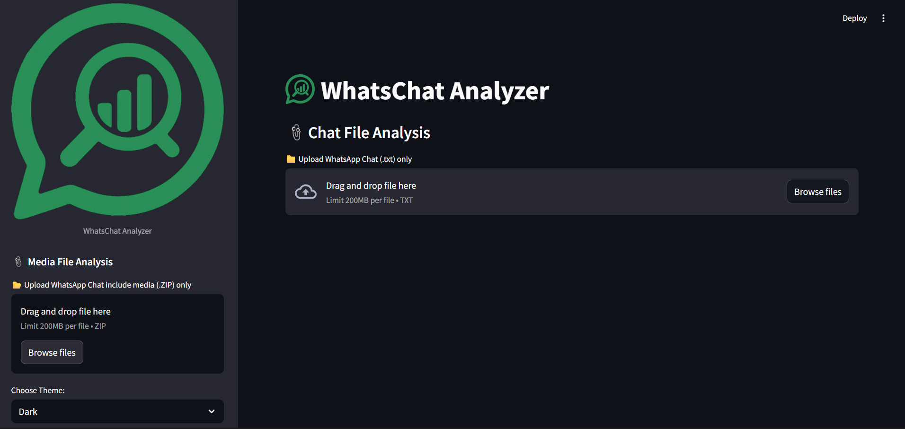

# WhatsChat

# 📊 WhatsChat Analyzer

A powerful and interactive Streamlit-based tool to analyze WhatsApp chats — including message trends, sentiment, media content, user activity, and more — from exported `.txt` or `.zip` files.


---

## 📚 Table of Contents

- [Introduction](#introduction)
- [Demo](#demo)
- [Features](#features)
- [Installation](#installation)
- [Usage](#usage)
- [Examples](#examples)

---

## 📌 Introduction

**WhatsChat Analyzer** is an all-in-one solution to explore your WhatsApp group or personal chat history. It supports both chat-only `.txt` files and full `.zip` exports (including media), providing rich visualizations and advanced insights using modern data science techniques.

---

## 🎥 Demo

> *Coming Soon!*  


---

## ✨ Features

- 📁 Upload `.txt` chat files or `.zip` exports with media
- 📈 Message trends, sentiment timeline, word clouds, activity heatmaps
- 😊 Emoji frequency and top usage stats
- 🧠 Clustering & sentiment-based insights
- 📊 Per-user filtering and keyword search
- 🔗 Most shared links overview
- 🖼️ Media previews (images, videos, PDFs, DOCX)
- 🧾 EXIF metadata for images
- 🔊 Basic audio file analysis
- 📌 Pinned and most replied message detection
- 🌙 Light/Dark theme toggle

---

## ⚙️ Installation

1. Clone the repository:
```bash
git clone https://github.com/uttam9379/WhatsChat.git
cd WhatChat

2.Install required packages:
pip install -r requirements.txt

3.Run the app:
streamlit run Chats.py

✅ Make sure icon.png is present in the root directory.


🚀 Usage
Upload a WhatsApp .txt file or .zip containing the chat and media.

Explore tabs: INFO, STATS, GRAPHS, LINKS, ADVANCE.

Use side filters to customize data by sender or keyword.

View media files and metadata automatically extracted from ZIP.

🧪 Examples
Chat Stats:
See total messages, top users, emoji usage, and sentiment breakdown.

Graphs:
Visualize messages over time, word clouds, active participants, and per-user sentiment.

Media Insights:
Preview media, read PDF/DOCX content, check image EXIF data, analyze audio lengths.
